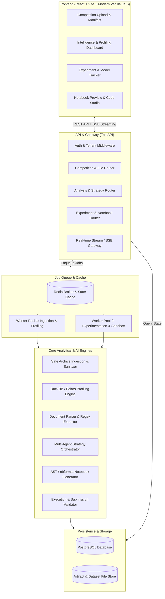
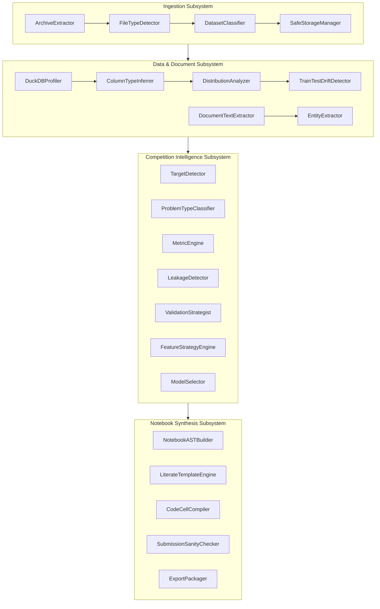
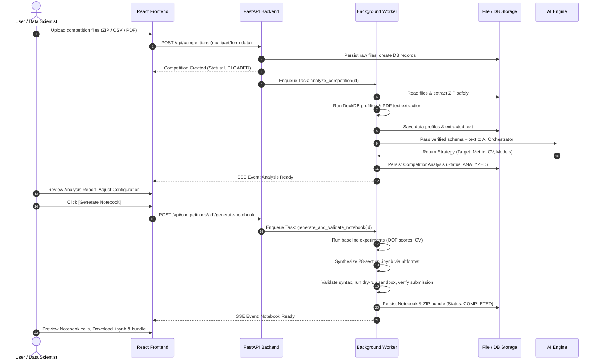
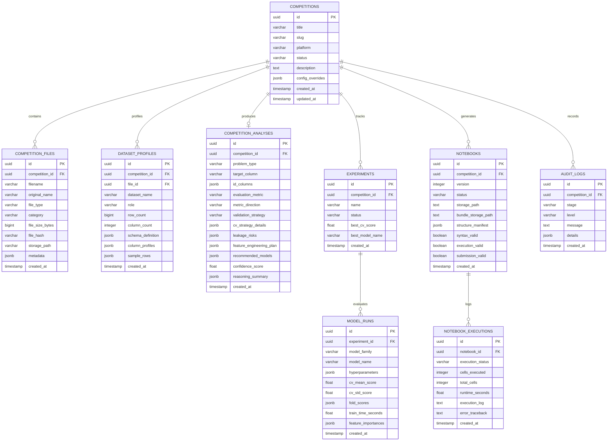
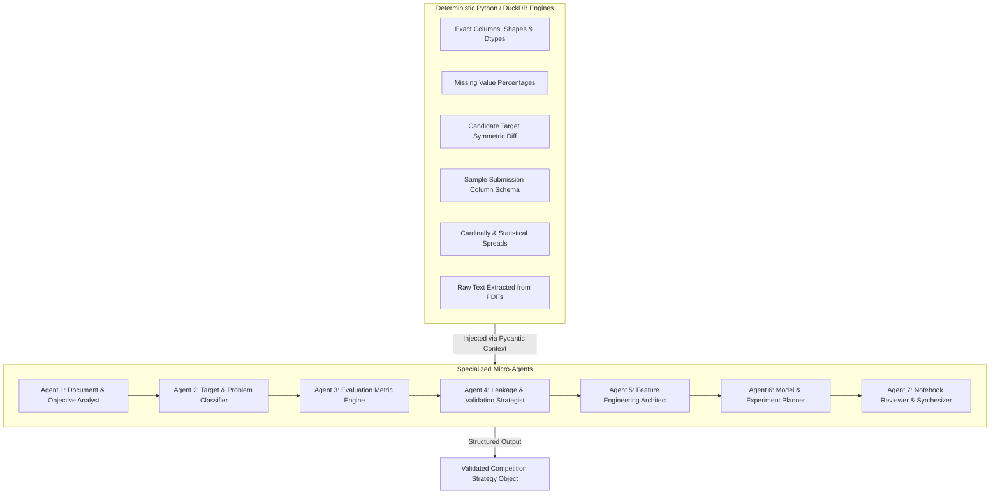
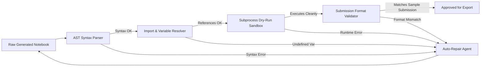

# AI Competition Analysis & Notebook Generation Platform
## Comprehensive Architectural Blueprint & Engineering Specification

---

## 1. Product Requirements & Vision

### 1.1 Product Vision
The **AI Competition Analysis & Notebook Generation Platform** is an enterprise-grade, autonomous machine learning assistant designed for data scientists, competitive ML practitioners, and researchers competing on platforms like **Zindi** and **Kaggle**. 

Instead of generating superficial, generic template code or relying on ungrounded LLM hallucinations, the platform adheres strictly to the core engineering principle:
$$\text{Understand First} \longrightarrow \text{Analyze Second} \longrightarrow \text{Experiment Third} \longrightarrow \text{Generate Notebook Last}$$

The platform accepts heterogeneous competition assets (problem descriptions, PDF rulebooks, raw CSV/Parquet/Excel files, ZIP archives, data dictionaries, and sample submissions), performs deterministic data profiling and document extraction, formulates a statistically sound validation and modeling strategy, validates baselines, and constructs a **clean, production-grade, reproducible, and self-contained Jupyter Notebook (`.ipynb`)** with zero placeholders (`TODO`, `pass`, or `YOUR_CODE_HERE`).

### 1.2 Target Personas
1. **Competitive Data Scientists (Zindi / Kaggle)**: Need an instant, mathematically rigorous, leakage-free benchmark solution with proper cross-validation, metric alignment, and submission verification.
2. **Corporate & Academic ML Teams**: Need accelerated exploratory data analysis (EDA), automated feature engineering pipelines, and reproducible baseline codebases tailored to custom tabular, time-series, or NLP challenges.
3. **Data Science Students & Aspirants**: Need pedagogical, best-practice code with inline explanations of evaluation metrics, CV strategies, and modeling trade-offs.

### 1.3 Core User Journeys
1. **Competition Workspace Creation**: User initializes a competition workspace and uploads documents (PDF/TXT/DOCX), tabular data (CSV/Parquet/XLSX), and sample submissions individually or in structured ZIP archives.
2. **Autonomous Document & Data Audit**: The platform extracts textual context, profiles raw datasets via fast columnar engines (DuckDB/Polars), establishes deterministic ground truth (shapes, dtypes, missingness, cardinality), and infers the target column, ID columns, metric, and problem type with explicit confidence scores.
3. **Interactive Strategy Review (Human-in-the-Loop)**: User reviews the synthesized "Competition Intelligence Report", inspecting data leakage warnings, proposed CV splits (e.g., StratifiedGroupKFold vs TimeSeriesSplit), candidate model families, and planned feature transforms. The user can override or confirm findings.
4. **Baseline & Rapid Experimentation Engine**: The platform executes localized baseline runs (LightGBM, CatBoost, XGBoost, Scikit-Learn) with cross-validation, logging out-of-fold (OOF) scores, feature importances, and resource profiles.
5. **Notebook Synthesis & Self-Validation**: The platform compiles a comprehensive, literate-programming Jupyter Notebook (`.ipynb`), validates it against syntax parsers and sandbox dry-run execution, checks submission format fidelity, and bundles the solution into a downloadable archive (`.ipynb`, `requirements.txt`, `README.md`, `config.yaml`).

---

## 2. Functional Requirements

### 2.1 Ingestion & Extraction Engine
- **Multi-Format Ingestion**: Handle single or bulk uploads of `.csv`, `.parquet`, `.xlsx`, `.json`, `.txt`, `.pdf`, `.docx`, and `.zip`.
- **Safe Archive Unpacking**: Inspect ZIP directory trees; enforce decompression ratios (prevent zip bombs); quarantine unrecognized binary formats; detect nested folders.
- **Content-Based File Categorization**: Heuristically and semantically tag files into:
  - `TRAIN_DATA` (contains target + candidate features)
  - `TEST_DATA` (features matching train, missing target)
  - `SAMPLE_SUBMISSION` (ID columns + target placeholder/prediction column)
  - `METADATA_DATA_DICTIONARY` (column explanations, descriptions)
  - `PROBLEM_DESCRIPTION_RULES` (PDF/TXT overview of problem and constraints)
  - `SUPPLEMENTARY_DATA` (ancillary lookup tables, geospatial shapefiles, timeseries aggregates)

### 2.2 Document Understanding Engine
- **Text & PDF Extraction**: Robust text extraction from PDFs (using `pypdf`/`pdfplumber`) and text files.
- **Structured Knowledge Extraction**: Extract competition title, objective, problem domain, evaluation metric name, target variable definition, submission constraints (row count, format, bounds), rules, and deadline dates.
- **Evidence-Linked Metadata**: Store extracted entities with textual snippets, character offsets, and confidence ratings ($0.0 - 1.0$).

### 2.3 Deterministic Data Profiling Engine
- **Zero-Hallucination Dataset Profiling**: Never prompt an LLM for row counts, column types, or missing values. All raw stats must be computed programmatically via **DuckDB** and **Polars**.
- **Per-Column Diagnostics**:
  - Exact row count, column count, memory footprint.
  - Column data type classification (numerical continuous, numerical discrete, low-cardinality categorical, high-cardinality categorical, datetime, free text, UUID/ID, constant, all-null).
  - Missing value counts, null percentages, empty string detections.
  - Cardinality, unique value ratios, top-5 frequent values with frequency distribution.
  - Summary statistics: mean, standard deviation, median, IQR, min, max, skewness, kurtosis.
- **Cross-Dataset Schema Reconciliation**: Compare `train` vs `test` column symmetric differences:
  - Detect feature drift / missing columns in test.
  - Verify ID column intersection and unique key integrity.
  - Reconcile `sample_submission` row count with `test` row count.

### 2.4 Intelligent Target & Problem Type Identification
- **Multi-Signal Target Classifier**:
  1. Set difference: $\text{Cols}(\text{Train}) \setminus \text{Cols}(\text{Test})$.
  2. Sample submission prediction column name matching.
  3. Problem description semantic matching.
  4. Train target data characteristics (unique values, dtype).
- **Taxonomy Classification**:
  - `Binary Classification` (2 distinct classes, discrete target).
  - `Multiclass Classification` ($>2$ distinct classes, discrete target).
  - `Multilabel Classification` (array/multi-column binary flags).
  - `Regression` (continuous numerical target, infinite support).
  - `Time-Series Forecasting` (explicit temporal ordering, horizon forecasting, lag dependencies).
  - `Ranking / Recommendation` (queries, items, relevance labels).
  - `NLP Classification / Regression` (text-dominant feature matrix).
  - `Computer Vision` (image paths / pixel matrices).

### 2.5 Evaluation Metric Alignment Engine
- **Competition Metric Registry**: Deep repository of standard and custom metrics:
  - Classification: `ROC-AUC`, `Log Loss`, `F1-Macro`, `F1-Micro`, `F1-Weighted`, `Accuracy`, `PR-AUC`, `Brier Score`, `Cohen's Kappa`, `Matthews Correlation Coefficient (MCC)`.
  - Regression: `RMSE`, `MAE`, `RMSLE`, `MSE`, `R2`, `MAPE`, `MedAE`, `Quantile Loss`.
  - Ranking / Custom: `NDCG@K`, `MAP@K`, `Zindi Custom Log Loss`, `Weighted F1`.
- **Metric Operationalization**: For every detected metric, determine:
  - Directionality (Maximize vs Minimize).
  - Output requirement (Raw probabilities vs calibrated binary labels vs continuous floats vs integer ranks).
  - Stratification and threshold optimization requirements (e.g. optimizing F1 decision threshold using Powell/Nelder-Mead optimization on OOF predictions).

### 2.6 Data Leakage Detection Engine
- **Target Leakage**: Correlation analysis between features and target; detection of duplicate rows across train and test.
- **ID & Sequence Leakage**: Correlation of sequential ID columns with target value or chronological progression.
- **Temporal Leakage**: Presence of future timestamps in train features when predicting historical or forward-looking targets.
- **Group Contamination**: Shared user/device/location entities present in both train and test that dictate `GroupKFold` necessity.
- **Transformation Leakage**: Enforce strict Scikit-learn Pipeline / cross-validation fold fit/transform discipline (fit on train fold only, transform on valid/test).

### 2.7 Validation Strategy Engine
- Deterministic selection rule:
  - Imbalanced Classification $\rightarrow$ `StratifiedKFold`.
  - Grouped / Entity-level data $\rightarrow$ `GroupKFold` or `StratifiedGroupKFold`.
  - Temporal / Time-series data $\rightarrow$ `TimeSeriesSplit` or Rolling Purged/Embargoed Walk-Forward Split.
  - Standard Regression $\rightarrow$ `KFold` (optionally stratified by binned target percentiles).

### 2.8 Baseline & Model Exploration Engine
- Train isolated baselines to establish a strong validation anchor:
  - Tabular: `LightGBM`, `CatBoost`, `XGBoost`, `HistGradientBoostingClassifier/Regressor`, with a simple linear/dummy baseline.
  - Text: `TF-IDF + Ridge/LogisticRegression` or lightweight embeddings.
- Automatic hyperparameter safety defaults (learning rate $0.03 - 0.05$, early stopping rounds $50$, conservative regularization).
- Optuna integration hooks for hyperparameter optimization search spaces.

### 2.9 Notebook Generation Engine
- Construct fully executable Jupyter notebooks via Python's official `nbformat` (v4).
- Structure into 28 standardized literate-programming sections.
- Dynamic injection of verified column names, verified file paths, detected target, selected metric implementation, and validated folds.
- Zero placeholder policy (`pass`, `TODO`, `YOUR_CODE_HERE` strictly prohibited).
- Standardized file paths (`DATA_DIR = Path("./data")`, etc.).

### 2.10 Notebook Self-Validation & Verification
- Compile code cells with Python AST to verify syntax validity.
- Automated static import resolution check.
- Verification of submission file generator (column names match sample submission, row count equals test set row count, no null/inf predictions).
- Sandboxed lightweight dry-run capability (running on subsampled $N=100$ records to confirm end-to-end execution without exceptions).

### 2.11 Packaging & Export
- Generate downloadable `.ipynb` notebook.
- Generate complete competition bundle (`.zip`) containing:
  - `solution_notebook.ipynb`
  - `README.md` (reproduction steps, hardware specs, directory layout)
  - `requirements.txt` (pinned dependencies)
  - `config.yaml` (runtime parameters, seed, paths)
  - `data/README.txt` (data placement instructions)

---

## 3. Non-Functional Requirements

| Metric / Dimension | Specification | Verification Method |
| :--- | :--- | :--- |
| **Correctness & Grounding** | 100% of column names, data types, missing values, and file dimensions must match exact DuckDB/Polars calculations. Zero hallucinated schema attributes. | Automated schema assert tests |
| **Reproducibility** | Centralized seed governance (`SEED = 42`) across Python `random`, `numpy`, `torch`, LightGBM, CatBoost, XGBoost. Identical inputs yield identical CV splits and predictions. | Deterministic test runs with identical random state |
| **Performance & Scalability** | Data profiling on 1,000,000 rows $\times$ 50 columns in $< 5$ seconds using DuckDB/Polars. Full metadata extraction and analysis generation in $< 30$ seconds. | Benchmarking suite on synthetic 1M row dataset |
| **Security & Isolation** | Untrusted ZIP archives parsed with path traversal protection (`os.path.commonpath`). Notebook execution validation executed in restricted sub-process / sandbox with memory and execution timeouts. | Pen-testing against malicious zip archives and arbitrary code payloads |
| **Reliability & Resilience** | Background tasks managed via transactional states. Long-running jobs resilient to worker restarts. Graceful degradation when LLM services encounter rate limits (exponential backoff). | Chaos test killing Celery/FastAPI worker during ingestion |
| **Maintainability & Clean Architecture** | Strict separation of concerns (Domain Models, Services, Analyzers, Agents, API routes). Type hints on 100% of Python code with Pydantic v2 schemas. | `mypy` strict type checking, `ruff` linting |

---

## 4. System Architecture

The platform adopts a decoupled, modern multi-tier architecture featuring:
1. **Presentation Layer**: React (TypeScript + Vite) single-page application with modern, custom CSS design system, dark-mode styling, and real-time Server-Sent Events (SSE) / WebSocket task monitoring.
2. **Application & API Layer**: FastAPI asynchronous web framework exposing OpenAPI 3.1 endpoints with dependency injection.
3. **Analytical & Orchestration Layer**: Dual-engine pipeline:
   - **Deterministic Analytical Subsystem**: DuckDB, Polars, PyArrow for high-throughput columnar analytics.
   - **Cognitive / AI Orchestration Subsystem**: Specialized micro-agents coordinating via structured Pydantic schemas and OpenAI-compatible LLM endpoints.
4. **Asynchronous Execution & Worker Layer**: Celery/ARQ job queue powered by Redis for background file processing, data profiling, model training, and notebook verification.
5. **Persistence & Storage Layer**: PostgreSQL relational database with SQLAlchemy 2.0 ORM, and local/S3-compatible object storage for uploaded and generated artifacts.



---

## 5. Component Architecture



### Module Responsibilities:
1. `app.services.ingestion`: Manages archive validation, zip-bomb prevention, file hashing, and schema-free file persistence.
2. `app.analyzers.data_profiler`: Executes DuckDB SQL queries across CSV/Parquet files to derive exact aggregate metrics without loading full tables into memory.
3. `app.analyzers.document_analyzer`: Uses deterministic regex and semantic text analyzers to extract competition details and constraints.
4. `app.agents.orchestrator`: Implements the multi-agent pipeline using typed inputs/outputs (Pydantic models) to eliminate unstructured text ambiguity.
5. `app.notebook.builder`: Programmatically creates `.ipynb` notebooks cell-by-cell using `nbformat.v4` structures.
6. `app.notebook.validator`: Executes AST parsing, syntax tree compilation, and isolated subprocess dry-runs with memory capping.

---

## 6. End-to-End Data Flow



---

## 7. Relational Database Schema



---

## 8. REST API & Streaming Architecture

| Method | Endpoint | Description | Request Body / Query | Response Model |
| :--- | :--- | :--- | :--- | :--- |
| `POST` | `/api/v1/competitions` | Create new competition workspace | `{title, platform, description}` | `CompetitionRead` |
| `GET` | `/api/v1/competitions` | List all competitions with status | `?page=1&limit=20&status=...` | `PaginatedResponse[CompetitionList]` |
| `GET` | `/api/v1/competitions/{id}` | Get competition details | - | `CompetitionDetail` |
| `DELETE` | `/api/v1/competitions/{id}` | Delete competition & artifacts | - | `{success: true}` |
| `POST` | `/api/v1/competitions/{id}/files` | Upload files (multipart) | Form: `files[]`, `category?` | `List[CompetitionFileRead]` |
| `GET` | `/api/v1/competitions/{id}/files` | List ingested files & categories | - | `List[CompetitionFileRead]` |
| `POST` | `/api/v1/competitions/{id}/analyze` | Trigger asynchronous analysis | `{force_reprofile: bool}` | `JobStatusResponse` |
| `GET` | `/api/v1/competitions/{id}/analysis` | Get complete intelligence report | - | `CompetitionAnalysisRead` |
| `PUT` | `/api/v1/competitions/{id}/analysis` | User override / edit strategy | `CompetitionAnalysisUpdate` | `CompetitionAnalysisRead` |
| `GET` | `/api/v1/competitions/{id}/datasets/profiles` | Get DuckDB data profiles | - | `List[DatasetProfileRead]` |
| `POST` | `/api/v1/competitions/{id}/experiments` | Launch baseline experiments | `{models: [], cv_folds: 5}` | `JobStatusResponse` |
| `GET` | `/api/v1/competitions/{id}/experiments` | Get experiment & model metrics | - | `List[ExperimentRead]` |
| `POST` | `/api/v1/competitions/{id}/generate-notebook` | Generate and validate notebook | `{include_eda: true, ...}` | `JobStatusResponse` |
| `GET` | `/api/v1/competitions/{id}/notebook` | Get current notebook JSON | - | `NotebookRead` |
| `GET` | `/api/v1/competitions/{id}/notebook/download` | Download `.ipynb` file | - | File Stream (`.ipynb`) |
| `GET` | `/api/v1/competitions/{id}/notebook/bundle` | Download `.zip` bundle | - | File Stream (`.zip`) |
| `GET` | `/api/v1/competitions/{id}/stream` | Server-Sent Events (SSE) live updates | - | `text/event-stream` |
| `GET` | `/api/v1/competitions/{id}/logs` | Fetch system audit logs | `?stage=...&level=...` | `List[AuditLogRead]` |

---

## 9. AI Orchestrator & Multi-Agent Architecture

To prevent hallucinations, the AI Orchestration layer enforces **Strict Separation of Programmatic Truth vs AI Synthesis**:



### Agent Specification Contracts:
1. **Document Analyst**: Inputs extracted PDF/text lines. Extracts domain background, problem formulation, and explicit evaluation rules.
2. **Target & Problem Classifier**: Ingests document summaries AND dataset symmetric differences. Computes target confidence score. Formats task taxonomy.
3. **Metric Engine**: Ingests target type and documentation. Identifies the exact metric function, directionality, and threshold-tuning requirements.
4. **Leakage & Validation Strategist**: Evaluates ID structures, entity grouping, and timestamps. Specifies cross-validation splitter (e.g. `StratifiedGroupKFold`) with mathematical justification.
5. **Feature Engineering Architect**: Ingests DuckDB column data types, missingness, and cardinality. Selects robust transforms (e.g., target encoding with Out-of-Fold protection, frequency encoding, cyclical datetime features).
6. **Model Planner**: Recommends candidate algorithms with explicit hyperparameter constraints suited to dataset row-to-column ratio and problem type.
7. **Notebook Synthesizer**: Converts the resolved strategy into concrete, executable Python code blocks using pre-tested literate programming templates.

---

## 10. Notebook Generation & Validation Architecture

The generated notebook is constructed using an Abstract Syntax Tree (AST) & `nbformat` generator. It is systematically organized into **28 literate programming sections**:

```text
Section 1:  Competition Overview & Problem Formulation
Section 2:  Environment Setup & Dependency Verification
Section 3:  Imports & Library Configurations
Section 4:  Global Configuration & Path Constants
Section 5:  Strict Reproducibility & Centralized Seeding
Section 6:  Safe Data Loading & Memory Optimization
Section 7:  Data Overview & Structural Sanity Checks
Section 8:  Exploratory Data Analysis (EDA) & Summary Visualizations
Section 9:  Data Quality Checks & Anomaly Detection
Section 10: Target Distribution Analysis & Class Imbalance Assessment
Section 11: Feature Distributions & Numerical/Categorical Inspections
Section 12: Data Leakage Verification & Train/Test Overlap Checks
Section 13: Preprocessing Pipeline & Missing Value Imputation
Section 14: Cross-Validation Strategy Setup & Fold Assignment
Section 15: Baseline Model Definition & Fast Benchmark
Section 16: Feature Engineering Pipeline (Encoding, Transformations, Domain Aggregations)
Section 17: Candidate Model Training (LightGBM, XGBoost, CatBoost)
Section 18: Out-of-Fold (OOF) Prediction Generation & CV Evaluation
Section 19: Metric Optimization & Optimal Decision Threshold Tuning
Section 20: Hyperparameter Tuning Protocol (Optuna Integration)
Section 21: Cross-Model Comparison & Evaluation Matrix
Section 22: Feature Importance Analysis (SHAP / Gain / Split)
Section 23: Ensembling & Blending (Rank Averaging / Weighted Probability)
Section 24: Final Model Refitting on Full Training Dataset
Section 25: Test Inference & Post-Processing
Section 26: Submission File Generation
Section 27: Submission File Verification (Row Count, Nulls, Bounds, IDs)
Section 28: Summary, Conclusions & Key Next Steps for Leaderboard Climbing
```

### Self-Validation Safety Harness:


---

## 11. Security Architecture

1. **Untrusted Archive Decompression**:
   - Limit total archive size (Max 500 MB per file, 2 GB total).
   - Enforce compression ratio cap ($< 10\times$) to neutralize ZIP bombs.
   - Strip directory traversal tokens (`../`, `..\\`) and resolve absolute paths using `os.path.commonpath`.
2. **Execution Sandboxing**:
   - Notebook validation runs in an isolated subprocess with restricted permissions (`chroot` / containerized / non-root user).
   - Strict resource limits: CPU execution timeout ($60$ seconds for dry run), memory ceiling ($2$ GB).
   - Network socket binding disabled during notebook validation dry runs.
3. **Storage & Multi-Tenancy**:
   - Competitions and associated data strictly isolated by UUIDs.
   - Path-based file access validated against competition storage roots.
4. **Credential Security**:
   - Zero hardcoded secrets. Environment-driven configuration via `.env` and `pydantic-settings`.

---

## 12. Complete Project Directory Layout

```text
competition-notebook-generator/
│
├── backend/
│   ├── app/
│   │   ├── api/
│   │   │   ├── v1/
│   │   │   │   ├── competitions.py
│   │   │   │   ├── files.py
│   │   │   │   ├── analysis.py
│   │   │   │   ├── experiments.py
│   │   │   │   ├── notebook.py
│   │   │   │   └── websocket.py
│   │   │   └── router.py
│   │   ├── core/
│   │   │   ├── config.py
│   │   │   ├── database.py
│   │   │   ├── events.py
│   │   │   ├── exceptions.py
│   │   │   ├── logging.py
│   │   │   └── security.py
│   │   ├── models/
│   │   │   ├── base.py
│   │   │   ├── competition.py
│   │   │   ├── file.py
│   │   │   ├── profile.py
│   │   │   ├── analysis.py
│   │   │   ├── experiment.py
│   │   │   └── notebook.py
│   │   ├── schemas/
│   │   │   ├── competition.py
│   │   │   ├── file.py
│   │   │   ├── profile.py
│   │   │   ├── analysis.py
│   │   │   ├── experiment.py
│   │   │   └── notebook.py
│   │   ├── services/
│   │   │   ├── competition_service.py
│   │   │   ├── file_service.py
│   │   │   ├── storage_service.py
│   │   │   └── audit_service.py
│   │   ├── analyzers/
│   │   │   ├── archive_inspector.py
│   │   │   ├── data_profiler.py
│   │   │   ├── document_analyzer.py
│   │   │   ├── schema_reconciler.py
│   │   │   └── metric_registry.py
│   │   ├── agents/
│   │   │   ├── llm_client.py
│   │   │   ├── prompts.py
│   │   │   ├── orchestrator.py
│   │   │   ├── document_analyst.py
│   │   │   ├── target_classifier.py
│   │   │   ├── validation_strategist.py
│   │   │   ├── feature_strategist.py
│   │   │   └── notebook_synthesizer.py
│   │   ├── notebook/
│   │   │   ├── builder.py
│   │   │   ├── templates.py
│   │   │   ├── validator.py
│   │   │   └── packager.py
│   │   ├── experiments/
│   │   │   ├── runner.py
│   │   │   ├── cross_validator.py
│   │   │   └── model_zoo.py
│   │   └── main.py
│   ├── tests/
│   │   ├── unit/
│   │   ├── integration/
│   │   └── fixtures/
│   ├── workers/
│   │   ├── celery_app.py
│   │   └── tasks.py
│   ├── requirements.txt
│   └── Dockerfile
│
├── frontend/
│   ├── src/
│   │   ├── assets/
│   │   ├── components/
│   │   │   ├── layout/
│   │   │   │   ├── Navbar.tsx
│   │   │   │   └── Sidebar.tsx
│   │   │   ├── common/
│   │   │   │   ├── Badge.tsx
│   │   │   │   ├── Card.tsx
│   │   │   │   ├── Button.tsx
│   │   │   │   └── Modal.tsx
│   │   │   ├── upload/
│   │   │   │   ├── FileDropzone.tsx
│   │   │   │   └── FileManifestList.tsx
│   │   │   ├── analysis/
│   │   │   │   ├── IntelligenceSummary.tsx
│   │   │   │   ├── DataProfileTable.tsx
│   │   │   │   └── StrategyReviewForm.tsx
│   │   │   ├── experiments/
│   │   │   │   ├── LeaderboardTable.tsx
│   │   │   │   └── FeatureImportancePlot.tsx
│   │   │   └── notebook/
│   │   │       ├── NotebookViewer.tsx
│   │   │       ├── SectionNavigator.tsx
│   │   │       └── DownloadActions.tsx
│   │   ├── pages/
│   │   │   ├── DashboardPage.tsx
│   │   │   ├── CompetitionCreatePage.tsx
│   │   │   ├── CompetitionDetailPage.tsx
│   │   │   ├── AnalysisPage.tsx
│   │   │   ├── ExperimentsPage.tsx
│   │   │   └── NotebookStudioPage.tsx
│   │   ├── services/
│   │   │   ├── api.ts
│   │   │   └── sse.ts
│   │   ├── types/
│   │   │   └── index.ts
│   │   ├── styles/
│   │   │   ├── tokens.css
│   │   │   ├── components.css
│   │   │   └── index.css
│   │   ├── App.tsx
│   │   └── main.tsx
│   ├── index.html
│   ├── package.json
│   ├── tsconfig.json
│   └── vite.config.ts
│
├── storage/
│   ├── uploads/
│   └── generated/
│
├── docker-compose.yml
├── .env.example
├── .gitignore
└── README.md
```

---

## 13. Technology Choices with Technical Justification

| Technology | Role | Justification |
| :--- | :--- | :--- |
| **FastAPI** | Backend Web Framework | Asynchronous I/O natively supports long-running analysis triggers, automated OpenAPI docs, and clean Pydantic v2 data contract enforcement. |
| **DuckDB** | Columnar Analytical Profiler | Embedded OLAP engine capable of executing complex SQL aggregations on million-row CSV and Parquet files in milliseconds with zero external daemon overhead. |
| **Polars** | Data Manipulation & Schema Inference | Blazing fast Rust-based DataFrame library; zero-copy Apache Arrow integration; outperforms Pandas by $10-50\times$ on CSV parsing and type detection. |
| **nbformat** | Notebook Synthesis Engine | The official Jupyter format specification library, guaranteeing 100% valid JSON AST compliant with JupyterLab, VS Code, Google Colab, and Kaggle Kernels. |
| **PostgreSQL 16** | Relational Database | ACID transactions, robust JSONB support for unstructured analysis outputs and data profiles, high concurrency reliability. |
| **Redis & Celery** | Distributed Task Queue | Decouples intensive data ingestion, model exploration, and notebook validation from HTTP request-response cycles. |
| **React 18 + Vite** | Frontend Platform | Extremely fast HMR, component-driven modularity, lightweight footprint, and type safety with TypeScript. |
| **Vanilla CSS (Design System Tokens)** | UI Styling | Adheres strictly to the project design directive: bespoke glassmorphism, tailored dark mode, curated HSL color tokens, zero Tailwind bloat, maximum layout control. |
| **OpenAI-Compatible LLM Client** | Multi-Agent Reasoning | Model-agnostic abstraction supporting Gemini 1.5/2.0, OpenAI GPT-4o, Claude 3.5 Sonnet, or local Ollama endpoints with identical schemas. |

---

## 14. 15-Phase Development Plan

- **Phase 1: Project Scaffolding & Environment Initialization**: Directory tree, configuration management (`config.py`), base logging, Docker compose setup.
- **Phase 2: Database Layer & Domain Models**: SQLAlchemy 2.0 async engine, declarative models, Alembic migrations, database session lifecycle.
- **Phase 3: File Ingestion & Storage Subsystem**: Safe archive unpacker, file type detector, file hashing, storage abstractions, upload endpoints.
- **Phase 4: Document Analysis Engine**: PDF/TXT parser, regex entity extractor, problem context aggregator.
- **Phase 5: High-Performance Data Profiler**: DuckDB & Polars profiling engine, schema reconciliation, train/test drift detection.
- **Phase 6: Deterministic Target, Problem & Metric Classifier**: Rule-based & multi-signal classifier, comprehensive competition metric registry.
- **Phase 7: Validation & Data Leakage Engine**: Temporal/Group/Stratified CV decision tree, train-test contamination and ID leakage detectors.
- **Phase 8: AI Orchestration & Multi-Agent Pipeline**: Structured Pydantic agent contracts, LLM client abstraction, synthesis orchestrator.
- **Phase 9: Baseline & Model Exploration Engine**: LightGBM / CatBoost baseline runners, cross-validation scoring, feature importance extraction.
- **Phase 10: Notebook Generation Engine (`nbformat`)**: 28-section literate programming template engine, AST-based code cell compiler.
- **Phase 11: Notebook Self-Validation & Verification Harness**: AST syntax validation, import checker, subprocess dry-run sandbox, submission sanity check.
- **Phase 12: Packaging & Solution Exporter**: Bundle creator (`.ipynb`, `requirements.txt`, `README.md`, `config.yaml`), download endpoints.
- **Phase 13: Modern Frontend Dashboard (React + TypeScript + CSS Tokens)**: Upload interface, intelligence summary, profiling viewer, notebook studio.
- **Phase 14: End-to-End Integration & Real-Time SSE Updates**: Celery worker integration, SSE real-time state streaming, error boundaries.
- **Phase 15: Automated Testing & Synthetic Competition Benchmark**: Unit tests, integration tests, full verification on a synthetic Zindi-style competition.

---

## 15. MVP Definition (Phases 1–6 Focus)

The Minimum Viable Product (MVP) delivers a fully functional, verifiable end-to-end loop:
1. **Upload**: User uploads a ZIP or CSV bundle (e.g. `train.csv`, `test.csv`, `sample_submission.csv`, `description.txt`).
2. **Analysis**: Platform safely ingests files, executes DuckDB profiling, identifies target/metric/CV strategy, and records zero hallucinations.
3. **Synthesis**: Platform generates a 28-section, competition-specific, verified `.ipynb` notebook ready to run.
4. **Verification**: AST syntax check and submission format validation pass.
5. **Download**: User downloads the standalone notebook and generates a valid `submission.csv`.

---

## 16. Future Enhancements
- **Direct Zindi & Kaggle API Sync**: Automatic download of competition assets and direct CLI submission upload.
- **Automated Stacking & Ensembling**: Multi-layer stacking with out-of-fold blending meta-models.
- **Computer Vision & Audio Pipelines**: Automatic CNN/ViT architectures for image and spectrogram competitions.
- **Interactive In-Browser Cell Execution**: Integrated WebAssembly/Pyodide or containerized JupyterLab kernel.

---

## 17. Risk Analysis & Mitigation Strategies

| Risk | Impact | Likelihood | Mitigation Strategy |
| :--- | :--- | :--- | :--- |
| **LLM Hallucination on Columns / Shapes** | Critical | High (if unconstrained) | **Architectural hard barrier**: LLMs are never asked for column names, row counts, or data types. Exact DuckDB/Polars profiles are injected into LLM prompt contexts. |
| **Zip-Bomb / Host File Traversal** | Critical | Low | Strict decompression size cap ($10\times$ ratio), path sanitization via `os.path.commonpath`, rejecting absolute path entries in archives. |
| **Out-Of-Memory (OOM) on Large Datasets** | High | Medium | Use DuckDB streaming query evaluation and Polars lazy scans. Never execute full in-memory Pandas loads during initial profiling. |
| **Submission Format Drift / Disqualification** | High | Medium | Automated programmatic comparison of generated predictions against `sample_submission.csv` (column names, ordering, row count, null check, bounds check). |
| **Notebook Runtime Breakage in External Env** | High | Medium | Pure standard dependencies (`numpy`, `pandas`, `scikit-learn`, `lightgbm`), fixed paths relative to `DATA_DIR`, self-validation AST syntax checking. |
